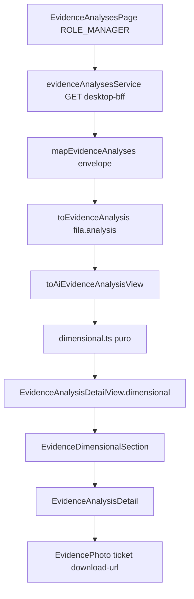
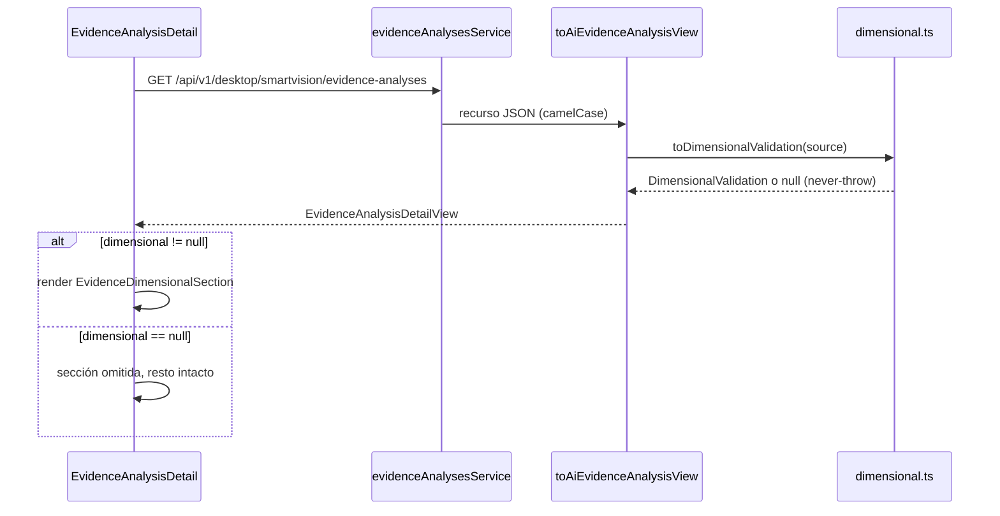

# Design — dimensional-evidence-validation-web

## Overview

Esta especificación extiende el detalle de análisis de evidencia del frontend web para exponer la validación dimensional que publica el backend de IA (`SmartVisionAnalysisResource` vía `desktop-bff`): 7 campos aditivos y nulables más `validationSummary` preexistente. El rol `ROLE_MANAGER` ya hoy consulta el historial de fotos enviadas por el conductor en `/evidence-analyses`; el diseño se concentra en tipar, mapear y mostrar la sección «Validación dimensional» dentro del detalle, sin alterar el encabezado «Estado del análisis» ni el flujo de estado existente.

**Users**: gestor (`ROLE_MANAGER`) que revisa fotos de evidencia y su análisis IA; desarrollador frontend que mantiene el contrato.
**Impact**: modifica `src/features/evidence-analyses/` (tipos, mappers, componentes) y añade un módulo puro de utilidades dimensionales. No toca backend, Flutter, endpoints ni el layout del detalle existente.

### Goals
- Aceptar los 7 campos como opcionales/nulables con glosario cerrado (ni 6 ni 8) más `validationSummary`.
- Mapear de forma never-throw desde cualquier carga útil, con `reasonCodes` canónico y confianza 0-1 estricta.
- Renderizar la sección «Validación dimensional» con los tres ejes, confianza, veredicto, acción, motivos y chip «Origen» condicional, degradando a gris lo ausente.
- Mantener `validationSummary` como fuente única del resumen (sin fallback a `aiSummary`).
- Conservar sin cambios la capa de gestión del rol manager (ruta protegida, historial desktop-bff, foto con ticket).

### Non-Goals
- Backend, BFF ni Flutter; publicar `captureSource`/`locationSource`.
- Semáforo de veredicto como flujo de estado, tabla de etiquetas es-PE como requisito, teoría de degradación pre-V3 (requisitos 3/5/7/8 retirados).
- i18n: labels de usuario hardcodeados en español (convención del repo).
- Reemplazar los campos legacy `confidenceScore`/`fraudScore` fuera de la sección dimensional.

## Architecture

### Existing Architecture Analysis

Patrón existente a respetar: feature-slice `src/features/evidence-analyses/` con `types/` (vista), `services/` (mappers puros + servicios HTTP sobre `fleetApi`), `components/` (React 19 + Tailwind) y `hooks/` (react-query). Helpers de deserialización en `src/utils/smartvision.ts` (`record`, `textField`, `numberField`, `degradedSections`) — todos tolerantes a basura y sin excepciones.

- `toAiEvidenceAnalysisView` (services/evidenceMappers.ts:4) es el mapper único del recurso; `mapEvidenceAnalyses` consume el envelope `SmartVisionAnalysisOverviewResource` y `mergeEvidenceDetail` fusiona listado + detalle directo.
- `EvidenceAnalysisDetail` comparte foto (`EvidencePhoto` + ticket `GET /api/v1/mobile/evidence/{id}/download-url`), banner `DegradedSectionsBanner`, encabezado «Estado del análisis» y bloques de campos.
- Control de acceso: `RoleGuard require="ROLE_MANAGER"` envuelve `/evidence-analyses` (src/routes/index.tsx:55).
- Tests: `node --test` sobre `tests/*.test.ts` (lógica pura, import con extensión `.ts`) y `tests/*.test.mjs` (render SSR vía `tests/helpers/vite.mjs` → `vite.ssrLoadModule`).

Límites de dominio a mantener: los mappers no hacen I/O; el DOM no conoce claves del wire; las claves leídas son exclusivamente camelCase del glosario.

### High-Level Architecture



### Technology Alignment

Sin dependencias nuevas: TypeScript strict, React 19, Tailwind CSS v4, react-query, axios (`fleetApi`). Se añaden dos archivos (`services/dimensional.ts`, `components/EvidenceDimensionalSection.tsx`) siguiendo los patrones de la propia feature. Desviaciones: ninguna.

### Key Design Decisions

**1. Módulo puro `services/dimensional.ts` para predicados y parsers**
- **Contexto**: R-WEB-1/2 exigen predicados exactos (`toVisualConfidence`, `parseReasonCodes`) y never-throw; el repo prueba lógica pura con `node:test` sin pasar por vite.
- **Alternativas**: (a) funciones inline en `evidenceMappers.ts`; (b) clases con estado; (c) librería `zod` para parseo.
- **Selected**: funciones exportadas puras en un archivo dedicado.
- **Rationale**: testeables directamente desde `node --test`, cero acoplamiento a React/axios, descarta `zod` (el contrato es degradación a `null`, no de fallo).
- **Trade-offs**: un archivo más en la feature a cambio de aislamiento y pruebas baratas.

**2. Subobjeto anidado `dimensional: DimensionalValidation | null` en la vista**
- **Contexto**: hay que decidir cuándo renderizar la sección (R-WEB-4: «WHEN el detalle incluye datos dimensionales») y hacer merge sin sobrescribir presentes con nulos (R-WEB-2).
- **Alternativas**: (a) 7 campos planos opcionales en la raíz de `EvidenceAnalysisDetailView`; (b) objeto siempre presente con todos los campos en `null`; (c) objeto anidado `null` cuando ningún campo de los 7 está presente.
- **Selected**: (c). `null` = sin datos dimensionales (un `reasonCodes: []` cuenta como ausente; una confianza inválida cuenta como ausente).
- **Rationale**: el predicado de presencia es explícito y de un vistazo, el merge es localizado y el render no necesita computar presencia en el componente.
- **Trade-offs**: una capa de anidación más en el DTO de vista frente a una semántica de presencia clara.

**3. `validationSummary` single-source (se elimina el fallback `aiSummary`)**
- **Contexto**: el mapper actual hace `textField(source, 'validationSummary', 'aiSummary')`, violando R-WEB-2 (fuente única).
- **Alternativas**: (a) mantener el fallback; (b) doble campo `summary`/`aiSummary`; (c) leer solo `validationSummary`.
- **Selected**: (c), cambiando la línea del mapper a `textField(source, 'validationSummary')`.
- **Rationale**: el backend ya publica plantilla ES en `validationSummary` (FB-004); un fallback reintroduce divergencia.
- **Trade-offs**: un registro con solo `aiSummary` legacy mostrará «Sin resumen registrado», que es el comportamiento requerido.

## System Flows



## Requirements Traceability

| Req | Resumen | Componentes | Interfaces |
|-----|---------|-------------|------------|
| R-WEB-1 | Contratos opcionales/nulables, predicado confianza, camelCase, `captureSource`/`locationSource` | `types/index.ts`, `dimensional.ts`, `evidenceMappers.ts` | `AiEvidenceAnalysisResource`, `toVisualConfidence`, `toDimensionalValidation` |
| R-WEB-2 | Mapeo never-throw, `parseReasonCodes`, `validationSummary` single-source, merge preserva presentes | `dimensional.ts`, `evidenceMappers.ts` | `parseReasonCodes`, `mergeEvidenceDetail`, `toAiEvidenceAnalysisView` |
| R-WEB-3 | Tres ejes con color, confianza `formatConfidence01`, chip «Origen» condicional | `EvidenceDimensionalSection.tsx` | `<EvidenceDimensionalSection dimensional={...} />` |
| R-WEB-4 | Sección «Validación dimensional» separada del encabezado, sin colisión de etiquetas | `EvidenceAnalysisDetail.tsx`, `EvidenceDimensionalSection.tsx` | composición del detalle |
| R-WEB-5 | Rol manager: ruta protegida, historial desktop-bff, envelope, foto con ticket, estados de error | `routes/index.tsx`, `evidenceAnalysesService.ts`, `EvidencePhoto.tsx` (ya existentes) | verificación sin cambios de código |

## Components and Interfaces

### Capa de contrato (`src/features/evidence-analyses/types/index.ts`)

**Responsibility & Boundaries**: tipar el recurso HTTP y el modelo de vista; cero lógica.

- `AiEvidenceAnalysisResource` gana campos opcionales exclusivamente camelCase:
  - `visualAssessment?: string | null`, `visualConfidence?: number | null`, `geographicAssessment?: string | null`, `contextAssessment?: string | null`, `verdict?: string | null`, `reasonCodes?: string[] | string | null`, `recommendation?: string | null`
  - `captureSource?: 'CAMERA' | 'GALLERY' | null` (opcional, fuera de la lista cerrada; no publicado hoy → FB-001)
  - **Prohibido**: leer `overallVerdict`, `analysisSummary`, `consistencyScore`, `rationale`, `summary` como claves dimensionales, y cualquier clave snake_case. `locationSource` no se tipa.
- Nuevo tipo de vista:

```ts
type AxisVisual = 'COMPATIBLE' | 'INCOMPATIBLE' | 'UNDETERMINED';
type AxisGeo = 'MATCH' | 'MISMATCH' | 'UNVERIFIABLE';
type AxisContext = 'COMPATIBLE' | 'PARTIAL' | 'INCONSISTENT';
type VerdictValue = 'COMPATIBLE' | 'REVIEW_REQUIRED' | 'INCONSISTENT';
type RecommendationValue = 'AUTO_APPROVE' | 'MANUAL_REVIEW' | 'REJECT';
type ReasonCode =
  | 'VISUAL_INCOMPATIBLE_SCENE' | 'VISUAL_UNDETERMINED' | 'GEO_MISMATCH'
  | 'GEO_UNVERIFIABLE' | 'GALLERY_CAPTURE_LOCATION_UNVERIFIED'
  | 'CONTEXT_TEMPORAL_MISMATCH' | 'CONTEXT_PARTIAL_DATA';

type DimensionalValidation = {
  visualAssessment: AxisVisual | null;
  visualConfidence: number | null;
  geographicAssessment: AxisGeo | null;
  contextAssessment: AxisContext | null;
  verdict: VerdictValue | null;
  reasonCodes: { known: ReasonCode[]; unknown: string[] };
  recommendation: RecommendationValue | null;
  captureSource: 'CAMERA' | 'GALLERY' | null;
};
```

- `EvidenceAnalysisDetailView` añade `dimensional: DimensionalValidation | null`.
- Invariante: valores fuera de vocabulario → `null` (comportamiento neutro, nunca excepción).

### Capa de mapping (`src/features/evidence-analyses/services/dimensional.ts`) — nueva

**Responsibility & Boundaries**: traducción pura wire → vista; sin I/O, sin React, never-throw.

```ts
toVisualConfidence(value: unknown): number | null
// Estricto: typeof number && Number.isFinite && 0 <= v <= 1; si no → null.
// Sin clamp, sin reescala, sin división por 100; `0` es válido.

formatConfidence01(value: number | null): string
// null → '—'; 0 → '0%'; 0.92 → '92%'; Math.round(v*100) sin decimales.

parseReasonCodes(value: unknown): { known: ReasonCode[]; unknown: string[] }
// Array canónico primero, sin JSON.parse. string → try/catch JSON.parse;
// si no produce arreglo utilizable → [string] como código único.
// null/undefined/[] → { known: [], unknown: [] } (ausente).
// dedup preservando orden en ambos; unknown nunca se filtra ni fusiona;
// tipos inesperados → ambos vacíos. Nunca lanza.

toDimensionalValidation(source: Record<string, unknown>): DimensionalValidation | null
// Aplica vocabularios cerrados por eje; construye reasonCodes;
// devuelve null si ningún campo de los 7 está presente
// (reasonCodes vacío ≡ ausente; confianza inválida ≡ ausente).

mergeDimensional(context, detail): DimensionalValidation | null
// Ganancia a detalle cuando aporta valor presente; conserva el de
// contexto cuando detalle trae null; nunca fabrica valores.
```

Dependencias outbound: ninguna (módulo hojuelo). Inbound: `evidenceMappers.ts`.

### Capa de mapping (`services/evidenceMappers.ts`) — modificación

- `toAiEvidenceAnalysisView`: además de los campos actuales, `dimensional: toDimensionalValidation(source)`; `summary` pasa a `textField(source, 'validationSummary')` (single-source, se retira `aiSummary`).
- `mergeEvidenceDetail`: añade `dimensional: mergeDimensional(context.dimensional, detail.dimensional)` para no sobrescribir presentes con nulos.
- El resto del mapper (identidad, contexto operativo, degradedSections) queda intacto.

### Capa UI (`components/EvidenceDimensionalSection.tsx`) — nueva

**Responsibility & Boundaries**: renderizar la sección dimensional; no lee el wire.

Props: `{ dimensional: DimensionalValidation }`.

Estructura (bloque con borde propio, hereda `space-y` del detalle):

1. Título «Validación dimensional» (`text-xs uppercase text-[#64748B]`), visualmente separado del encabezado «Estado del análisis» que no se modifica.
2. **Tres ejes** en `grid sm:grid-cols-3`: etiqueta («Visual»/«Geográfico»/«Contextual»), valor y punto de color según matriz de ejes — verde: `COMPATIBLE`/`MATCH`; rojo: `INCOMPATIBLE`/`MISMATCH`/`INCONSISTENT`; gris: `UNDETERMINED`/`UNVERIFIABLE`/`PARTIAL`/`null`.
3. **Confianza visual**: `formatConfidence01(visualConfidence)`; `null` → «—» en gris. Nunca usa `confidenceScore` legacy.
4. **Veredicto**: campo con etiqueta «Veredicto» y valor en español (`COMPATIBLE`→«Aprobación sugerida», `REVIEW_REQUIRED`→«Revisión requerida», `INCONSISTENT`→«Rechazo sugerido»); etiqueta distinta de «Estado del análisis» para evitar la colisión nominal.
5. **Acción operativa**: campo separado con prefijo «Acción: » (`AUTO_APPROVE`→«Proceder con cierre automático», `MANUAL_REVIEW`→«Inspeccionar evidencia manualmente», `REJECT`→«Solicitar aclaración o desestimar»). No se colapsa con el veredicto ni se deriva de él.
6. **Motivos**: chips de `known` con etiqueta es-PE de los 7 códigos; `unknown` se muestra con el código crudo (nunca se omite).
7. **Chip «Origen»**: solo si `captureSource === 'CAMERA'` («Cámara») o `'GALLERY'` («Galería»); si es `null`/ausente se omite por completo, sin «Origen: —». Es metadato, no eje.

Valores contractuales ausentes → texto «—» en gris; el render nunca lanza excepción.

### Capa UI (`components/EvidenceAnalysisDetail.tsx`) — modificación mínima

- Dentro de `EvidenceAnalysisResult`, inmediatamente después del bloque de encabezado («Estado del análisis» / «Tipo»):

```tsx
{analysis.dimensional ? <EvidenceDimensionalSection dimensional={analysis.dimensional} /> : null}
```

- «Estado del análisis», foto, banner de secciones degradadas, resumen, motivos de fallo, etiquetas y OCR quedan intactos y en su posición.

### Capa de integración rol manager (R-WEB-5) — verificada, sin cambios

| Elemento | Estado actual |
|----------|---------------|
| Ruta `/evidence-analyses` bajo `RoleGuard require="ROLE_MANAGER"` | src/routes/index.tsx:55-59 ✔ |
| Mensaje de acceso restringido sin el rol | src/app/auth/RoleGuard.tsx:56 ✔ |
| Historial `GET /api/v1/desktop/smartvision/evidence-analyses` (desktop-bff, token propagado) | services/evidenceAnalysesService.ts:9 ✔ |
| Envelope de 7 campos + `degradedSections` + identidad `clientEvidenceId` | `mapEvidenceAnalyses` + `DegradedSectionsBanner` ✔ |
| Foto vía ticket `GET /api/v1/mobile/evidence/{id}/download-url` con skeleton/error | `EvidencePhoto` + `evidencePhotoService` ✔ |
| Estado de error «últimos datos disponibles» | EvidenceAnalysisDetail.tsx:209 y EvidenceAnalysesPage:196 ✔ |

## Data Models

### Contrato HTTP publicado (camelCase, 8 claves + opcional)

| Clave | Tipo wire | Vista | Notas |
|-------|-----------|-------|-------|
| `visualAssessment` | `string \| null` | `visualAssessment` | vocab. cerrado 3 valores |
| `visualConfidence` | `number \| null` | `visualConfidence` | escala 0-1 estricta; fuera de rango → `null` |
| `geographicAssessment` | `string \| null` | `geographicAssessment` | vocab. cerrado 3 valores |
| `contextAssessment` | `string \| null` | `contextAssessment` | vocab. cerrado 3 valores |
| `verdict` | `string \| null` | `verdict` | vocab. cerrado 3 valores |
| `reasonCodes` | `string[]` (`[]` = ausente) | `reasonCodes.known/unknown` | canónico array, sin `JSON.parse` |
| `recommendation` | `string \| null` | `recommendation` | vocab. cerrado 3 valores |
| `validationSummary` | `string \| null` | `summary` | preexistente, fuente única del resumen |
| `captureSource` | no publicado hoy | `captureSource` | opcional; chip condicional (FB-001) |

## Error Handling

### Error Strategy
La ruta dimensional no lanza excepciones: toda entrada inesperada degrada a `null`/vacío y el resto del detalle renderiza. Los errores de red mantienen los flujos existentes (skeleton, alerta de reintento, «últimos datos disponibles», 404 con mensaje específico).

### Error Categories and Responses
- **Entrada malformada (no es error de usuario)**: clave desconocida → solo payload crudo (no se tipa); tipo incorrecto → campo `null`; vocabulario fuera de catálogo → `null`; `captureSource` con valor raro → chip omitido.
- **Red (5xx/timeout)**: sin cambios — el detalle conserva datos previos y muestra la alerta existente con «Reintentar»/«Actualizar análisis».
- **Autorización (403)**: `RoleGuard` bloquea la vista completa; la foto muestra «No tienes permiso» sin ocultar el análisis.
- **404 de análisis**: mensaje existente «Todavía no hay un análisis registrado…».

### Monitoring
Sin telemetría nueva; se reutilizan los estados de error ya renderizados con `role="alert"`.

## Testing Strategy

Aunque el requisito de pruebas (R-WEB-8) se retiró de la spec, el repo exige TDD (`npm run test`), por lo que la implementación se desarrolla con pruebas:

- **Unit Tests** (`tests/dimensional.test.ts`, `node:test` + import `.ts`):
  - `toVisualConfidence`: `0`→`0`, `0.92`→`0.92`; `92.5`/`2.5`/`1.1`/`-0.1`/`NaN`/`Infinity`/`'0.92'`/`null`→`null` (sin clamp ni /100).
  - `formatConfidence01`: `0`→`'0%'`, `0.92`→`'92%'`, `0.925`→`'93%'`, `null`→`'—'`.
  - `parseReasonCodes`: array canónico sin `JSON.parse`, string contingencia → código único, `null`/`[]` → vacíos, dedup con orden preservado, unknown visible, nunca lanza.
  - `toDimensionalValidation`: presencia (todo nulo + `[]` → `null`), vocabulario fuera de catálogo → `null`, subconjunto parcial → presente con nulos.
  - Mapper: `summary` solo desde `validationSummary` (sin `aiSummary`), `mergeDimensional` preserva presentes.
- **Integration/UI Tests** (`tests/evidence-ui.test.mjs`, SSR):
  - Sección visible con datos; oculta cuando `dimensional === null` (el resto del detalle intacto).
  - Ejes en gris con valores nulos; confianza `0%`/`—`; chip «Origen» omitido cuando `captureSource` es `null`.
  - Etiquetas «Estado del análisis» y «Veredicto» coexisten y son distintas; «Motivo no catalogado» visible con código crudo.
- **Regression**: `npm run test`, `npm run lint` y `npm run build` en verde; los tests existentes de evidencia siguen pasando.

## Security Considerations

- Sin endpoints nuevos ni cambios de autenticación: se usa `fleetApi` con la propagación de token existente.
- Autorización de vista por `ROLE_MANAGER` (ya implementada) — R-WEB-5.
- Glosario estricto camelCase: claves no reconocidas (`locationSource`, snake_case) nunca se tipan ni se renderizan.
- No se persisten ni loguean fotos, tickets de descarga ni tokens; el ticket de descarga se consume de forma efímera (query de react-query con expiración).
