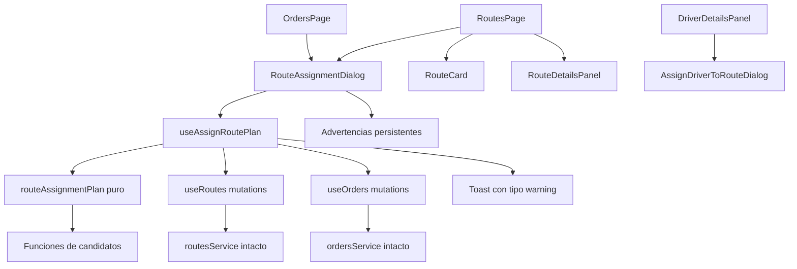
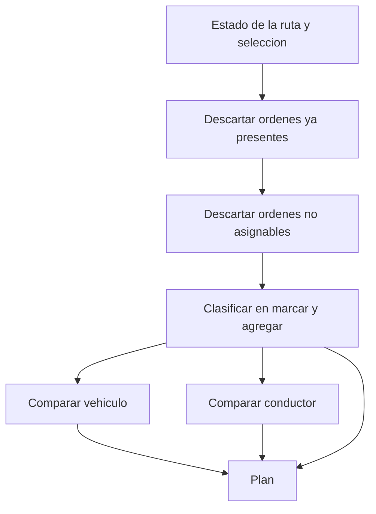
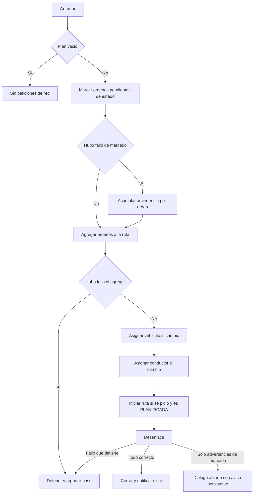
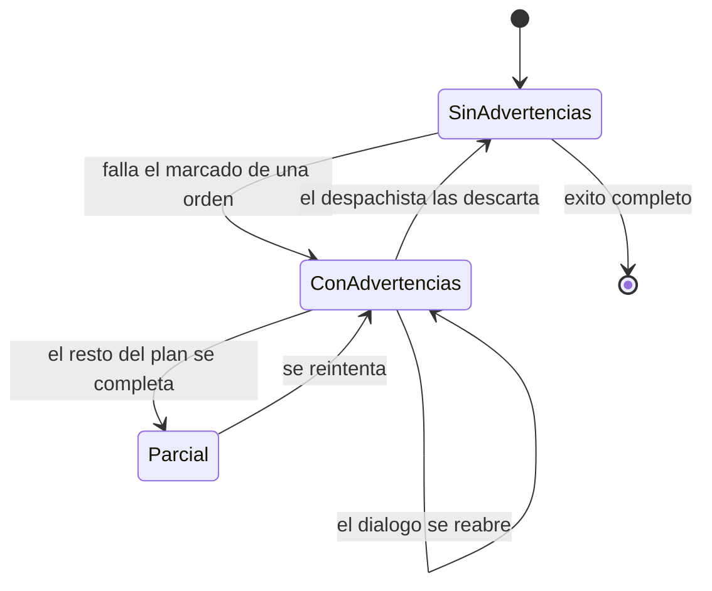
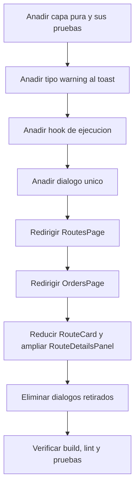

# Technical Design

## Overview

Esta feature reemplaza el recorrido de configuracion de rutas por un dialogo unico que persiste ordenes, vehiculo y conductor en una sola accion. El despachista deja de completar cuatro modales secuenciales y pasa a confirmar un unico formulario, disponible tanto desde la tarjeta de ruta como desde el detalle de la orden.

El valor central no es la consolidacion visual sino la idempotencia del guardado. El dialogo no reenvia el estado completo de la ruta: calcula un **plan de cambios** que compara la seleccion del usuario contra el estado vigente de la ruta y emite unicamente las operaciones necesarias. Reabrir el dialogo y pulsar Guardar sin tocar nada no produce ninguna peticion de red, y reasignar solo el vehiculo no reenvia las ordenes. Esta propiedad se implementa en una capa pura sin dependencias de React ni de red, lo que la hace verificable de forma exhaustiva con el runner de tests del proyecto.

La feature es una extension de un sistema existente. No altera el contrato con el backend: los siete endpoints de rutas y ordenes que ya consume el frontend se orquestan desde una capa nueva de planificacion y ejecucion. Los endpoints, el servicio de rutas y los hooks individuales de mutacion permanecen sin cambios.

### Goals

- Reducir la configuracion completa de una ruta a un unico dialogo con una unica accion de guardado.
- Garantizar que el guardado solo ejecute las operaciones que el usuario cambio realmente.
- Exponer de forma explicita y persistente cualquier orden que quedo fuera de la asignacion.
- Unificar la seleccion de candidatos entre `/routes` y `/orders`, hoy divergente.
- Preservar el contrato con el backend sin modificar endpoints ni el servicio de rutas.

### Non-Goals

- Modificar endpoints, sus payloads o la capa de normalizacion de identificadores.
- Persistir advertencias entre recargas de pagina; viven en memoria de la sesion del navegador.
- Introducir una libreria de gestion de estado o de formularios. No se agregan dependencias.
- Reemplazar el dialogo de asignacion de conductor al que acceden el panel de conductor y la pagina de conductores.
- Cualquier rediseño de los cuatro filtros de la pagina de rutas.

## Architecture

### Existing Architecture Analysis

La aplicacion sigue una organizacion por features verticales bajo `src/features/`, donde cada feature agrupa `pages/`, `components/`, `hooks/`, `services/`, `types/` y `validations/`. El acceso a datos se divide en dos: React Query para consulta y cache, y funciones de servicio en `services/` que envuelven una instancia de axios (`fleetApi`) con los identificadores del backend normalizados de `number` a `string`.

`routesService.ts` y `ordersService.ts` exponen metodos por endpoint. `useRoutes.ts` los envuelve en mutaciones que, ademas de la peticion, actualizan la cache de forma optimista con `setQueryData` e invalidan las claves relacionadas. Esa politica de cache es reutilizable tal cual y no debe duplicarse.

La logica pura se ubica en `services/` junto a los mappers (por ejemplo `evidenceMappers.ts` y `alertMappers.ts`), y se cubre con `node:test` importando el archivo TypeScript con extension explicita. No hay framework de tests de componentes: la verificacion de interfaz se resuelve con la disciplina de tipado del build.

Dos limitaciones del codigo actual condicionan el diseno. Primera, `ToastType` solo admite `success` y `error`, y el componente de toast elige el icono con un ternario binario y muestra un unico `title`, por lo que no puede expresar una advertencia ni un detalle por orden. Segunda, `RoutesPage` consulta ordenes con la clave `['orders','route-actions']` mientras el resto de la aplicacion usa `['orders']`, generando dos caches del mismo recurso; la invalidacion por prefijo las mantiene sincronizadas, pero el dialogo dependera de esa lista de candidatos y aumentaria el riesgo de mostrar una orden que ya cambio de ruta.

### High-Level Architecture



La feature no altera `routesService.ts` ni `useRoutes.ts`. El hook nuevo consume sus mutaciones existentes mediante la promesa asincrona que React Query expone, de modo que la politica de cache actual se ejecuta sin duplicacion.

### Technology Alignment

No se introduce ninguna dependencia. La feature usa React Query v5 (mutaciones y cache), Tailwind v4 para estilos, `node:test` para la capa pura y el alias `@/` ya configurado. El proyecto no tiene i18n, por lo que los labels se escriben en espanol directamente en los componentes, igual que en `RouteStatusBadge.tsx` y `OrdersPage.tsx`.

El unico ajuste transversal es extender `ToastType` en `src/components/ui/` con el valor `warning` y permitir un detalle por linea. Es una adicion backward compatible: los dos tipos existentes y todas sus pantallas mantienen su comportamiento actual.

### Decisiones de diseno

#### Decision 1: El plan se calcula en una capa pura separada del hook y del dialogo

- **Contexto**: La idempotencia del guardado depende de comparar la seleccion contra el estado vigente de la ruta. Esa comparacion es logica de negocio determinista y no necesita React ni red.
- **Alternativas consideradas**: (a) calcular las diferencias dentro del componente con `useMemo`, lo que deja la regla fuera de alcance de los tests al no haber runner de componentes; (b) calcularlas dentro del hook, lo que mezcla la regla con la orquestacion de red y obliga a probarla con las mutaciones montadas; (c) aislarla en un modulo puro que el hook consume.
- **Enfoque elegido**: Opcion (c). Un modulo `routeAssignmentPlan.ts` sin imports de React ni de axios.
- **Justificacion**: Es la unica opcion que cumple la Requirement 2 completa con el runner disponible. La funcion de planificacion es determinista y su tabla de casos es enumerable, lo que la hace barata de cubrir exhaustivamente.
- **Trade-offs**: Introduce una indireccion y obliga a serializar a mano la vista de la ruta y la vista de orden que recibe la funcion pura, aceptando projections minimas en lugar de los tipos completos. A cambio, la regla mas importante del producto queda verificada sin mocks.

#### Decision 2: Dos niveles de aviso, con la advertencia persistente en el hook y no en el dialogo

- **Contexto**: Un toast dura 3.2 segundos y solo admite un titulo. Un despachista que pierde tres ordenes de un despacho de ocho necesita saber cuales quedaron fuera incluso despues de cerrar el dialogo.
- **Alternativas consideradas**: (a) un unico toast con el resumen; (b) un toast por orden fallida, lo que inunda la pantalla si fallan muchas; (c) un aviso efimero mas un acumulado persistente en memoria de sesion.
- **Enfoque elegido**: Opcion (c). El hook `useAssignRoutePlan` posee un mapa de advertencias indexado por identificador de ruta. El dialogo lo presenta junto al control de guardado, y la pagina que lo monta lo conserva al cerrar y reabrir.
- **Justificacion**: Cumple los requisitos 4 y 10 sin inventar almacenamiento nuevo, y ancla el estado al mismo lugar que produce los fallos, evitando que el componente tenga que conciliar ese estado con su propio ciclo de vida.
- **Trade-offs**: Las advertencias se pierden al recargar la pagina o al navegar fuera del feature. A cambio, no hay estado global nuevo ni esquema de persistencia, y el alcance del trabajo sigue siendo acotado.

#### Decision 3: Ejecucion secuencial con dos clases de fallo

- **Contexto**: El plan produce hasta cinco tipos de operacion sobre endpoints que no aceptan transacciones conjuntas. Un fallo al marcar una orden como lista para despacho no deberia impedir asignar un vehiculo, pero un fallo al agregar una orden si invalida la asignacion.
- **Alternativas consideradas**: (a) detener en el primer fallo de cualquier tipo, que hace que una orden sporadica bloquee el despacho completo; (b) continuar ante cualquier fallo, que deja la ruta en un estado parcial no declarado; (c) dos clases de fallo con politicas distintas.
- **Enfoque elegido**: Opcion (c). El marcado de estado es recuperable por orden: si falla, esa orden se acumula como advertencia y la secuencia sigue. Cualquier otra operacion detiene la secuencia y reporta en que paso ocurrio.
- **Justificacion**: Separa el fallo que degrada un elemento del fallo que invalida el resultado. El marcado es un trampolin tecnico previo a la operacion real; las demas son la operacion real.
- **Trade-offs**: El resultado puede ser mixto y obliga a reportar tres desenlaces distintos (exito, parcial, error). A cambio, el comportamiento se explica en una frase: lo que no es esencial se omite con aviso, lo que es esencial detiene.

#### Decision 4: El dialogo es un unico componente con variantes por props

- **Contexto**: El dialogo se abre desde la tarjeta de ruta (ruta fija, ordenes libres) y desde el detalle de la orden (orden fija, ruta elegible). Implementarlos como componentes separados duplicaria la logica de planificacion y el marcado de advertencias.
- **Alternativas consideradas**: (a) dos componentes que comparten un nucleo; (b) un componente con props opcionales que alterna entre variantes; (c) un componente generico de selector por dimension.
- **Enfoque elegido**: Opcion (b). Props `route` y `routes` determinan si la ruta es fija o elegible; `lockedOrderId` determina si la lista de ordenes se muestra o se colapsa a la orden en edicion.
- **Justificacion**: Ambas variantes comparten el 90 por ciento de su estructura y, sobre todo, el mismo calculo del plan. Un solo componente garantiza que ambas entradas produzcan exactamente el mismo plan para el mismo estado.
- **Trade-offs**: El componente tiene mas ramas condicionales que un componente por variante. A cambio, no existe el riesgo de que las dos entradas diverjan, que fue el defecto del diseno actual.

#### Decision 5: Reutilizar las mutaciones existentes mediante su promesa, no llamar a los servicios

- **Contexto**: La feature necesita encadenar varias mutaciones y manejar cada resultado por separado. Los hooks existentes ya resuelven la actualizacion de cache y las invalidaciones.
- **Alternativas consideradas**: (a) invocar los servicios directamente desde el hook nuevo, replicando la politica de cache; (b) montar las mutaciones existentes y encadenar su promesa asincrona; (c) crear un endpoint de asignacion masiva en el backend.
- **Enfoque elegido**: Opcion (b). React Query expone una promesa por mutacion que resuelve con el recurso actualizado y rechaza con el error original, de modo que el encadenamiento secuencial y el manejo por paso se resuelven sin `then` anidados.
- **Justificacion**: Mantiene la Requirement 8 intacta: los hooks de rutas no se modifican, y sus efectos de cache siguen siendo el unico lugar que conoce las claves a invalidar.
- **Trade-offs**: El hook nuevo depende de varias mutaciones montadas simultaneamente, lo que aumenta el acoplamiento con `useRoutes.ts`. La alternativa (a) habria duplicado esa politica y creado el riesgo de divergir de ella.

## Flujos del sistema

### Construccion del plan



El plan es un valor puro. `estaVacio` determina si el control de guardado se habilita, sin lo cual el dialogo deshabilita Guardar y ninguna peticion sale a la red.

### Ejecucion del plan



### Advertencias persistentes



## Componentes e interfaces

### Capa de planificacion

#### routeAssignmentPlan

**Responsabilidad y limites**

- **Responsabilidad primaria**: convertir el estado vigente de una ruta mas la seleccion del usuario en un plan ordenado de operaciones pendientes, y decidir si ese plan merece ejecutarse.
- **Frontera de dominio**: feature de rutas, subdominio de planificacion de asignacion.
- **Datos que posee**: ninguno. Es una funcion pura sin estado interno.
- **Frontera transaccional**: ninguna. No realiza efectos.

**Dependencias**

- **Entrantes**: `RouteAssignmentDialog` y `useAssignRoutePlan`.
- **Salientes**: unicamente tipos de `../types` y los tipos de orden de `@/features/orders/types`. No importa React, ni axios, ni los hooks.

**Contrato de servicio**

```typescript
type RouteAssignmentSnapshot = {
  id: string;
  status: RouteStatus;
  vehicleId: string | null;
  driverId: string | null;
  orderIds: string[];
  finishedOrderIds: string[];
};

type OrderCandidate = {
  id: string;
  status: OrderStatus;
};

type RouteAssignmentSelection = {
  orderIds: string[];
  vehicleId: string;
  driverId: string;
  startRoute: boolean;
};

type RouteAssignmentPlan = {
  orderIdsToMarkReady: string[];
  orderIdsToAdd: string[];
  vehicleIdToAssign: string | null;
  driverIdToAssign: string | null;
  shouldStartRoute: boolean;
};

interface RouteAssignmentPlanService {
  buildPlan(
    route: RouteAssignmentSnapshot,
    selection: RouteAssignmentSelection,
    orders: OrderCandidate[],
  ): RouteAssignmentPlan;
  isPlanEmpty(plan: RouteAssignmentPlan): boolean;
  candidateOrdersForRoute(orders: Order[], route: RouteAssignmentSnapshot): Order[];
  assignableVehicles(vehicles: Vehicle[], route: RouteAssignmentSnapshot): Vehicle[];
  assignableDrivers(drivers: Driver[], route: RouteAssignmentSnapshot): Driver[];
  candidateRoutesForOrder(routes: Route[], orderId: string): Route[];
}
```

**Precondiciones**

- `orders` contiene la proyeccion de estado de cada orden, incluido el identificador de la ruta que ya tiene asignada cuando exista.
- Los identificadores de la seleccion son cadenas producidas por la capa de mapeo; `buildPlan` no las valida como numeros.

**Postcondiciones**

- `orderIdsToAdd` es disjunto de `orderIds` y de `finishedOrderIds` de la ruta.
- `orderIdsToMarkReady` es subconjunto de `orderIdsToAdd` y no contiene ordenes en `IN_TRANSIT`, `DELIVERED` ni `CANCELLED`.
- `orderIdsToMarkReady` y `orderIdsToAdd` respetan el orden de la seleccion del usuario, lo que hace el plan reproducible.
- `vehicleIdToAssign` es distinto del vehiculo vigente, o `null` si no se selecciono o no cambio.
- `driverIdToAssign` es distinto del conductor vigente, o `null` si no se selecciono o no cambio.
- `shouldStartRoute` es verdadero unicamente si la seleccion lo pide y el estado de la ruta es `PLANNED`.

**Invariantes**

- `isPlanEmpty` es verdadero si y solo si las cinco operaciones del plan estan vacias o desactivadas.
- `assignableVehicles` y `assignableDrivers` siempre incluyen el recurso ya asignado a la ruta, exista o no su lista de estado admita, para que el valor vigente sea observable y conservable.
- Ninguna funcion de este modulo realiza entrada-salida ni lanza por datos incompletos: una ruta sin ordenes produce un plan con la lista de ordenes vacia.

### Capa de orquestacion

#### useAssignRoutePlan

**Responsabilidad y limites**

- **Responsabilidad primaria**: ejecutar el plan en orden, tolerar el fallo de marcado por orden, detener la secuencia ante cualquier otro fallo y acumular las advertencias resultantes.
- **Frontera de dominio**: feature de rutas, subdominio de ejecucion.
- **Datos que posee**: estado de la ejecucion en curso, advertencias acumuladas por identificador de ruta, paso fallido de la ultima ejecucion y ordenes aplicadas.
- **Frontera transaccional**: cada operacion es atomica en el backend; la secuencia no lo es y no puede revertirse.

**Dependencias**

- **Entrantes**: `RouteAssignmentDialog`, `RoutesPage`, `OrdersPage`.
- **Salientes**: `routeAssignmentPlan`, las mutaciones de `useRoutes.ts`, las mutaciones de estado de orden de `useOrders.ts` y el proveedor de notificaciones.

**Contrato de servicio**

```typescript
type RouteAssignmentStep =
  | 'MARK_ORDER_READY'
  | 'ADD_ORDER'
  | 'ASSIGN_VEHICLE'
  | 'ASSIGN_DRIVER'
  | 'START_ROUTE';

type OrderWarning = {
  orderId: string;
  reason: string;
};

type RouteAssignmentFailure = {
  routeId: string;
  step: RouteAssignmentStep;
  orderId: string | null;
  reason: string;
};

type RouteAssignmentOutcome = 'SUCCEEDED' | 'PARTIAL' | 'FAILED';

type SubmitRouteAssignmentInput = {
  route: RouteAssignmentSnapshot;
  selection: RouteAssignmentSelection;
  orders: OrderCandidate[];
};

type SubmitRouteAssignmentResult = {
  outcome: RouteAssignmentOutcome;
  appliedOrderIds: string[];
  warnings: OrderWarning[];
  failure: RouteAssignmentFailure | null;
};

interface RouteAssignmentExecution {
  submit(input: SubmitRouteAssignmentInput): Promise<SubmitRouteAssignmentResult>;
  dismissWarnings(routeId: string): void;
  isPending: boolean;
  appliedOrderIds: string[];
  warningsByRoute: Record<string, OrderWarning[]>;
  lastFailure: RouteAssignmentFailure | null;
}
```

**Precondiciones**

- El plan recibido por `submit` se calcula a partir del mismo `route` y la misma `selection` que se pasan como entrada, de modo que el dialogo y el ejecutor no puedan discrepar sobre el estado de partida.

**Postcondiciones**

- Las operaciones se ejecutan estrictamente en el orden del plan.
- Ninguna operacion del plan se ejecuta dos veces para el mismo destino dentro de una misma invocacion.
- Un fallo de marcado no impide ejecutar las operaciones posteriores.
- Un fallo distinto del marcado impide toda operacion posterior.
- Al terminar, el mapa de advertencias de la ruta contiene exactamente las ordenes omitidas por fallo de marcado de esa invocacion, mas las de invocaciones previas no descartadas.

**Invariantes**

- Mientras `isPending` es verdadero, `submit` no vuelve a ejecutar el plan.
- `appliedOrderIds` solo contiene ordenes que el backend confirmo como-agregadas.

**Estrategia de integracion**

- **Enfoque de modificacion**: se anade un modulo nuevo que envuelve las mutaciones existentes. No se extiende ni se altera ninguna de ellas.
- **Compatibilidad hacia atras**: `useRoutes.ts` y `useOrders.ts` conservan sus firmas, sus claves de cache y su comportamiento actual, que los siguen usando los dialogos de conductor y de orden.
- **Ruta de migracion**: los cuatro modales que se retiran no tienen consumidores fuera de `RoutesPage`, salvo el dialogo de conductor, que se conserva. La transicion no requiere cambios en otras paginas.

### Capa de presentacion

#### RouteAssignmentDialog

**Responsabilidad y limites**

- **Responsabilidad primaria**: presentar las tres dimensiones de la asignacion en una sola pantalla, capturar la seleccion y delegar su persistencia.
- **Frontera de dominio**: feature de rutas, subdominio de interfaz.
- **Datos que posee**: seleccion en curso, texto del filtro de ordenes y confirmacion de descarte pendiente.
- **Frontera transaccional**: ninguna. No decide ni ejecuta.

**Dependencias**

- **Entrantes**: `RoutesPage` y `OrdersPage`.
- **Salientes**: `routeAssignmentPlan` para candidatos y preseleccion, `useAssignRoutePlan` para persistir, el proveedor de notificaciones para avisos, y el dialogo base de `@/components/ui`.

**Variantes**

| Variante | Origen | `route` | `routes` | `lockedOrderId` |
|---|---|---|---|---|
| Asignacion de ruta | `RoutesPage`, tarjeta de ruta | presente | ausente | ausente |
| Asignacion de orden | `OrdersPage`, detalle de orden | ausente | presente | presente |

**Reglas de derivacion**

- Con `route` presente, la seccion de ruta muestra el titulo vigente y no es editable; con `routes` presente, muestra un selector inicializado en la ruta ya asignada a la orden cuando exista.
- Con `lockedOrderId` presente, la seccion de ordenes no se lista: muestra la orden en edicion, marcada y no descartable, mas la nota de que conductor y vehiculo los determina la ruta elegida.
- Con `route` ausente, el control de guardado permanece deshabilitado hasta que se elija una ruta.
- El filtro de ordenes reduce la lista por identificador, direccion, ciudad y estado.

**Contrato de interfaz**

```typescript
type RouteAssignmentDialogProps = {
  open: boolean;
  route: RouteAssignmentSnapshot | null;
  routes: Route[];
  lockedOrderId: string | null;
  vehicles: Vehicle[];
  drivers: Driver[];
  orders: Order[];
  isSubmitting: boolean;
  warnings: OrderWarning[];
  onSelectedRouteChange: (routeId: string) => void;
  onSelectedOrderIdsChange: (orderIds: string[]) => void;
  onSelectedVehicleChange: (vehicleId: string) => void;
  onSelectedDriverChange: (driverId: string) => void;
  onStartRouteChange: (startRoute: boolean) => void;
  onDismissWarnings: () => void;
  onClose: () => void;
  onSubmit: (input: SubmitRouteAssignmentInput) => void;
};
```

### Adaptaciones de superficies existentes

#### RoutesPage

- Sustituye el discriminante `RouteAction` de cuatro valores por un unico estado de dialogo abierto y la ruta en edicion.
- Elimina los manejadores individuales de conductor, vehiculo, orden y orden entregada, y los tres estados de seleccion que solo existian para alimentarlos.
- Obtiene ordenes mediante el hook compartido de ordenes, con la clave de cache del resto de la aplicacion, en lugar de su propia consulta.
- Encadena la creacion de ruta: al crearla, abre el dialogo de asignacion para la ruta resultante.
- Conserva el filtro de estados, el buscador y los filtros de conductor y vehiculo sin cambios.
- Conserva la instancia de `useAssignRoutePlan` montada a nivel de pagina, de modo que las advertencias sobreviven al cierre del dialogo.

#### RouteCard

Reduce su contrato a tres acciones y dos etiquetas de solo lectura. El componente deja de recibir los cuatro manejadores de asignacion y pasa a recibir uno solo, invocado al pulsar asignar. El listado de ordenes finalizadas y los identificadores de conductor y vehiculo se conservan como datos.

#### RouteDetailsPanel

Anade un boton por orden pendiente que invoca el endpoint de ordenes entregadas a traves de la mutacion existente, con la misma politica de cache. No incorpora un dialogo adicional. En modo de orden fija desde la pagina de ordenes, ese panel no se renderiza, por lo que la variante de orden-unica debe aceptar un solo candidato en lugar de una coleccion.

#### Toast y Badge

`ToastType` extiende su union con el valor `warning`. El componente de toast selecciona icono y color mediante un mapa por tipo en lugar de un ternario, lo que admite el tercer caso sin alterar la salida de los dos existentes. El tipo de mensaje admite un detalle opcional por linea, y el ancho del aviso crece cuando existe. Los tipos `success` y `error` conservan icono, color, duracion y estructura actuales.

## Modelos de datos

No hay cambios en el modelo de datos ni en el contrato con el backend. La feature introduce dos estructuras propias de la UI.

### Vista de ruta para planificacion

La capa pura recibe una proyeccion de la ruta en lugar del tipo `Route` completo. La proyeccion existe para que el modulo de planificacion no dependa de la forma completa del recurso y para que sus tests puedan construir casos minimos. La proyeccion se deriva del campo `route` sin transformacion adicional.

### Advertencia de orden omitida

Una advertencia identifica la orden por su identificador de cadena y transporta el motivo legible del rechazo. La coleccion se indexa por identificador de ruta para que varias rutas puedan tener advertencias simultaneas sin colisionar, y para que reabrir el dialogo de una ruta muestre las suyas y no las de otra.

### Desenlace de la ejecucion

El desenlace distingue tres casos porque el dialogo reacciona de forma distinta en cada uno: exito cierra y notifica, parcial mantiene el dialogo abierto con advertencia persistente y resultado parcial, y error mantiene el dialogo abierto con el paso fallido y las ordenes aplicadas.

### Reglas de negocio

- Una orden solo es asignable si esta en `READY_FOR_DISPATCH`, `RECEIVED` o `PROCESSING`, y si no figura ni en la lista de ordenes de la ruta ni en la de ordenes finalizadas.
- Una orden asignable en `RECEIVED` o `PROCESSING` requiere marcado previo; en `READY_FOR_DISPATCH` no.
- Las ordenes en `IN_TRANSIT`, `DELIVERED` y `CANCELLED` quedan fuera del conjunto asignable y nunca se marcan.
- La ruta solo puede iniciarse desde `PLANNED`.
- Una ruta `COMPLETED` no ofrece ordenes como candidatas.

Las reglas se aplican en el calculo del plan, no en el dialogo. El dialogo solo presenta lo que el plan devuelve, de modo que la interfaz no puede contradecir la regla.

## Manejo de errores

### Estrategia

Tres familias, con respuesta y severidad distintas.

| Familia | Origen | Secuencia | Dialogo | Aviso |
|---|---|---|---|---|
| Marcado fallido | `PATCH /api/v1/orders/:id/ready-for-dispatch` | Continua | Permanece abierto | `warning` con detalle por orden |
| Operacion esencial | agregar orden, vehiculo, conductor, iniciar | Se detiene | Permanece abierto | `error` con paso fallido y ordenes aplicadas |
| Carga de catalogos | ordenes, vehiculos o conductores | No inicia | Controles deshabilitados | Estado de error en la seccion afectada |

El criterio de clasificacion es si la operacion es necesaria para el resultado o solo un pre-requisito tecnico. El marcado de estado es un pre-requisito: su fallo degrada una orden concreta y el resto del despacho sigue siendo valido. Las demas son el resultado.

### Extraccion del motivo

El motivo legible se obtiene del cuerpo de la respuesta de axios cuando el backend incluye un mensaje, y se sustituye por un texto generico cuando no lo incluye. El motivo por defecto nombra la orden afectada para que la advertencia sea accionable aun sin detalle del servidor.

### Confirmacion de descarte

Cerrar el dialogo con advertencias sin resolver requiere confirmacion. La confirmacion es un estado local del dialogo que intercepta el intento de cierre y vuelve a renderizar el boton de cerrar. Descartar descarta las advertencias de esa ruta y no exige guardar el plan.

### Monitoreo

No se anade telemetria. Los errores se reportan mediante el proveedor de notificaciones existente, que es el mecanismo de observabilidad del proyecto.

## Estrategia de pruebas

### Pruebas unitarias de la capa pura

Con `node:test` y `assert/strict`, importando el modulo con extension explicita, siguiendo el estilo de `tests/evidence-flow.test.ts`. Sin React, sin red y sin dobles de prueba.

- El plan no emite ninguna operacion cuando la seleccion replica exactamente el estado vigente de la ruta.
- El plan ignora un identificador de orden que no existe en la coleccion conocida, en lugar de agregarlo a ciegas.
- El plan no emite operaciones de ordenes cuando la seleccion esta vacia, pero si emite las de vehiculo o conductor cuando esas si cambiaron.
- El plan omite una orden que ya figura en las ordenes de la ruta y otra que solo figura entre las finalizadas.
- El plan clasifica en marcado previo las ordenes en `RECEIVED` y `PROCESSING`, y omite el marcado para las que ya estan en `READY_FOR_DISPATCH`.
- El plan no incluye en el marcado las ordenes en `IN_TRANSIT`, `DELIVERED` ni `CANCELLED`.
- El plan conserva el orden de la seleccion del usuario, haciendolo reproducible.
- El plan omite la asignacion de vehiculo o conductor cuando el valor seleccionado coincide con el vigente, y la emite cuando difiere.
- El plan solo marca el inicio de la ruta cuando la seleccion lo pide y el estado es `PLANNED`.
- El plan rechaza toda orden no asignable, de modo que una orden invalida nunca llegue al conjunto de candidatas.
- `isPlanEmpty` es verdadero exactamente cuando las cinco operaciones estan vacias.
- Las funciones de candidatos incluyen el recurso ya asignado aunque su estado no sea admisible, y excluyen los recursos no asignables.
- La seleccion de rutas para una orden excluye las rutas completadas y las que ya contienen esa orden.

### Verificacion de la capa de orquestacion

No hay runner de componentes ni de hooks, de modo que la logica de secuencia no admite pruebas unitarias directas. La cobertura se estructura en dos niveles.

La primera decision de la ejecucion, es decir que el plan vacio no emite ninguna peticion y que el fallo de marcado no detiene la secuencia, se verifica por construccion: ambas reglas viven en el modulo puro, que si esta cubierto por la suite. La segunda decision, el orden de las operaciones y el detenimiento ante un fallo esencial, se cubre de forma indirecta mediante el contrato de tipos del plan, cuyo orden de campos fija la secuencia, y mediante la disciplina de tipos del build, que rechaza cualquier llamada a un servicio distinto de los siete endpoints previstos.

### Verificacion de interfaz

Se ejecutan `npm run test`, `npm run lint` y `npm run build`. El build ejecuta `tsc -b`, que valida los contratos de props del dialogo frente a sus dos variantes de invocacion y detecta referencias a componentes eliminados.

## Consideraciones de rendimiento

La feature no introduce peticiones nuevas. La consolidacion de la clave de cache de ordenes elimina ademas una segunda consulta duplicada en la pagina de rutas, que pasara de dos fuentes de ordenes a una sola.

La cantidad de peticiones del plan es acotada por el numero de ordenes seleccionadas y se ejecuta de forma secuencial a proposito: el orden importa, porque el marcado debe preceder al agregado de cada orden. Un lote de ordenes pausado entre asignacion e inicio genera una llamada por orden en la peor de las iteraciones, con el trafico esperado dado que cada operacion muta una entidad distinta.

El dialogo lista catalogos completos en memoria, igual que ya lo hacen los selectores actuales, y el filtro de ordenes opera sobre la coleccion ya presente sin peticiones adicionales.

## Estrategia de migracion



Cada etapa es independiente y verificable por separado. Las etapas A a C no alteran comportamiento visible, por lo que un fallo se detecta en la suite de pruebas antes de tocar la interfaz.

- **Disparadores de reversion**: fallo de la suite de pruebas, error de compilacion de tipos, o cualquier violacion de la restriccion de endpoints.
- **Puntos de validacion**: la suite de pruebas tras A; el build tras C, tras D y al final; el analisis estatico en cada etapa que toque un componente existente.
- **Verificacion de que no hay regresion en el conducto de conductor**: `DriverDetailsPanel` sigue importando el dialogo de asignacion de conductor, que esta excluido de la eliminacion. El fallo de compilacion en ese import es la senal de que el alcance se tecnico.
